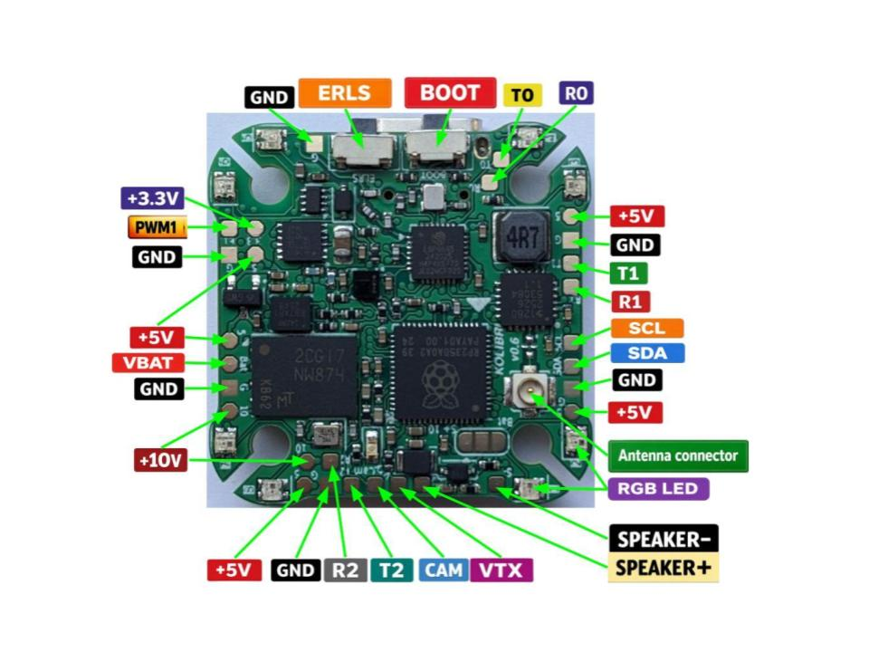
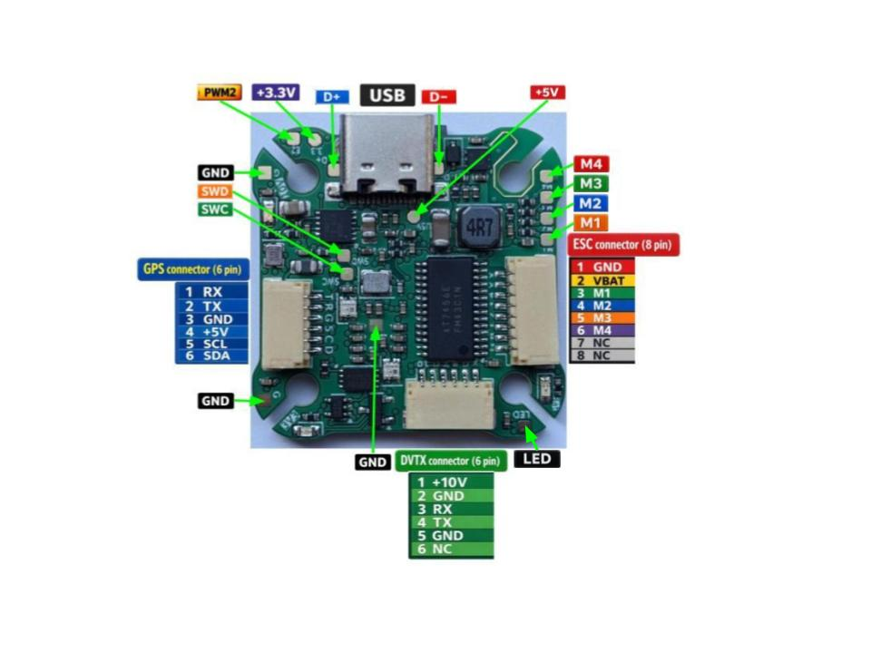

# Kolibri v0.6

This is an open-hardware project, that is available by the following link https://github.com/bastian2001/Kolibri-FC-Hardware

## Features

- Processor
  - RP2350A Cortex-M33 2-core 32-bit Processor
- Sensors
  - ICM-42688-P IMU
  - STM LPS22HB Baro
- Power
  - External Power Supply 3-8S
  - Logic level at 3.3V
  - 5V 2.5A, 10V 2.5A buck converters
- Interfaces
  - 4x PWM
  - 3x UARTs
  - 2x SPI
  - 1x I2C
  - 1x SWD
  - 1x USB (dual USB CDC)
- Memory
  - SRAM (520KB)
  - NOR Flash (2MB)
  - NAND Flash (256MB)
- Miscellaneous
  - Onboard ERLS 2.4 GHz + 2x PWM
  - Onboard 3 color LEDs
  - BOOT Button
  - ERLS Button

## Pinout

### Top view

<div align="left">



</div>

### Bottom view

<div align="left">



</div>

## UART Mapping

- SERIAL0 -> USB
- SERIAL1 -> UART0 (RCIN, Onboard ERLS 2.4GHz)
- SERIAL2 -> UART1 (GPS)
- SERIAL3 -> UART2 (DisplayPort)

## Connectors

Unless noted otherwise all connectors are JST GH 1.25mm pitch

### GPS port

   | Pin | Signal | Volt |
| --- | --- | --- |
| 1 (blk) | TX (OUT) | +3.3V |
| 2 (blk) | RX (IN) | +3.3V |
| 3 (blk) | GND | GND |
| 4 (blk) | VCC | +5V |
| 5 (blk) | SCL I2C0 | +3.3V |
| 6 (blk) | SDA I2C0 | +3.3V |

### ESC port

   | Pin | Signal | Volt |
| --- | --- | --- |
| 1 (blk) | GND | GND |
| 2 (blk) | VBAT | +12V...+32V |
| 3 (blk) | M1 (OUT) | +3.3V |
| 4 (blk) | M2 (OUT) | +3.3V |
| 5 (blk) | M3 (OUT) | +3.3V |
| 6 (blk) | M4 (OUT) | +3.3V |
| 7 (blk) | NC | - |
| 8 (blk) | NC | - |

### Display port

   | Pin | Signal | Volt |
| --- | --- | --- |
| 1 (blk) | VCC | +10V |
| 2 (blk) | GND | GND |
| 3 (blk) | TX (OUT) | +3.3V |
| 4 (blk) | RX (IN) | +3.3V |
| 5 (blk) | GND | GND |
| 6 (blk) | NC | - |

## Build

```bash
./waf configure --board Kolibri
```

```bash
./waf copter
```
